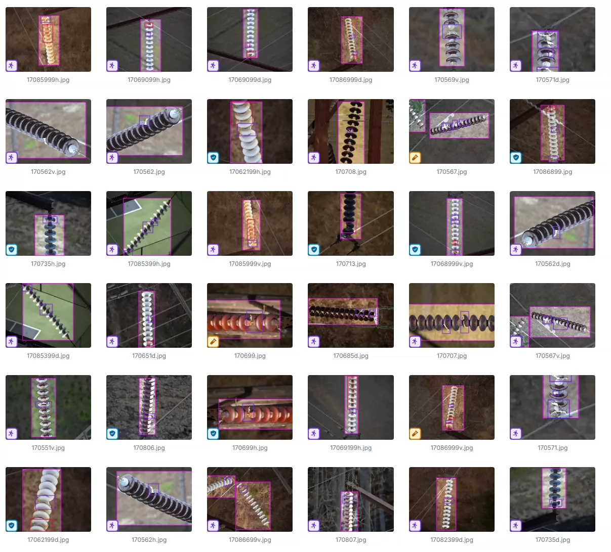
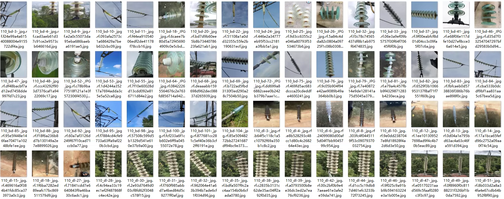
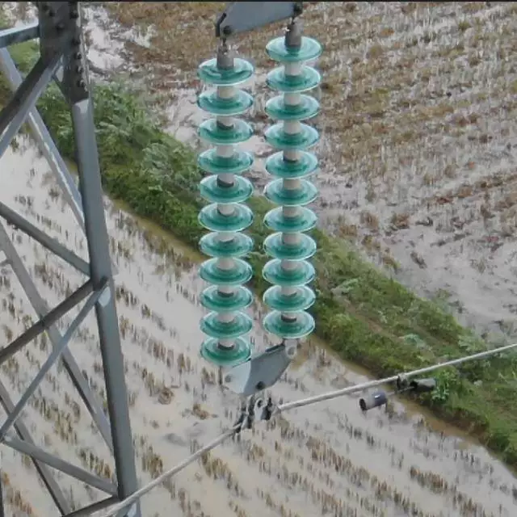
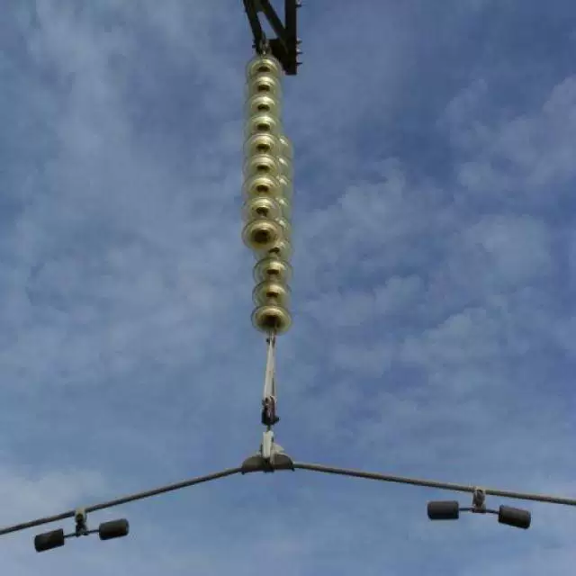
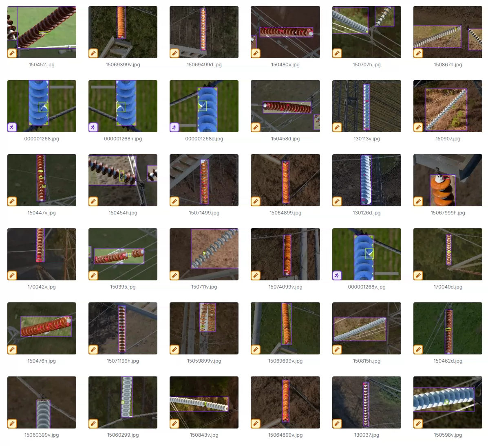
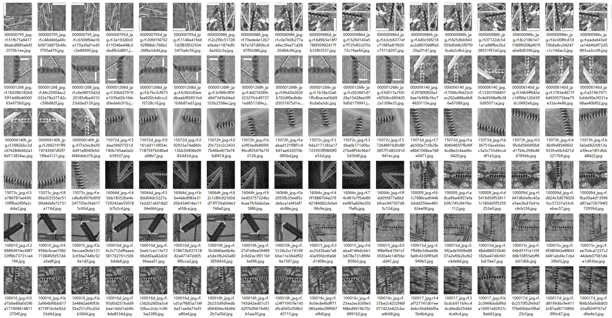
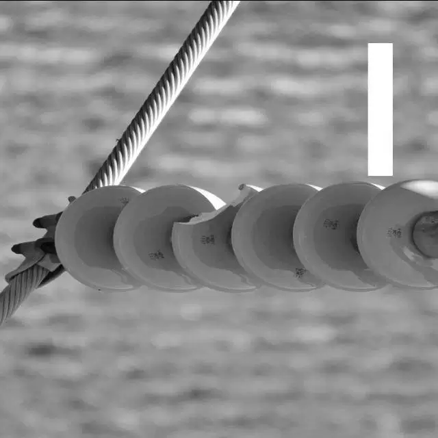
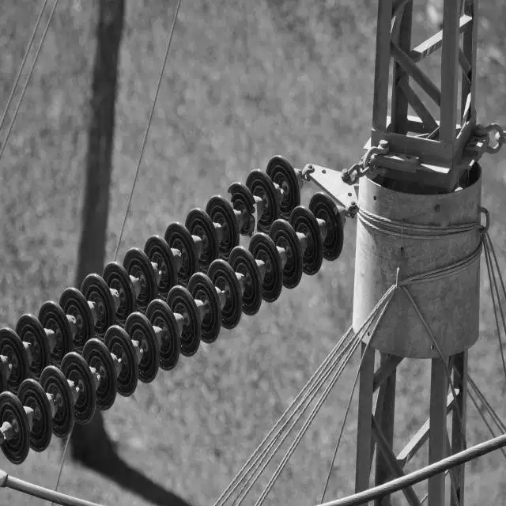

## Body

High Voltage Line Insulator Defect Dataset

Two datasets in total

Totally 2k images, each labeled appropriately.
Divided into 7 categories: 'Glassdirty', 'Glassloss', 'Polymer', 'Polymerdirty', 'broken disc', 'insulator', 'pollution-flashover'
                                'Glass dirty', 'Glass loss', 'Polymer', 'Polymer dirty', 'Broken disc', 'Insulator', 'Polluted flashover'

Totally 4k images, each labeled appropriately.
Divided into 3 categories: 'broken', 'insulator', 'pollution-flashover'
                                'Damaged', 'Insulator', 'Pollution flashover'

Electronic virtual products sold are non-refundable.

## Images

item_1032305607658

Here is a pay link on Stripe ( https://buy.stripe.com/3cs8yP7sY87d0vu9AB ). Please contact me lonlonago@foxmail.com after funding $89, and I will send you a complete data files , thank you!

